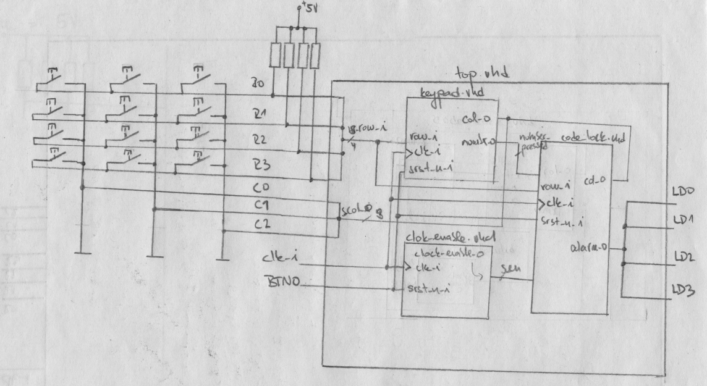
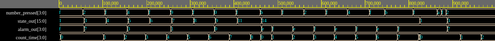
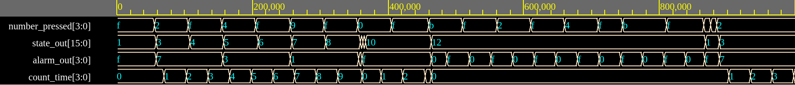
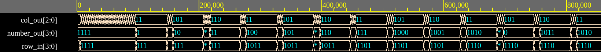

# Code lock with matrix keypad and time limit for entering the code
 
The code consist of 4 vhdl files
    
    - top.vhd
    - code_lock.vhd
    - keypad.vhd 
    - clock_enable.vhd 
    
Code simulation can be viewed at https://www.edaplayground.com/x/3wuV
Keypad simulation only can be viewed at https://www.edaplayground.com/x/5S69

## Schematic  

## keypad.vhd 

Matrix Keypad 4x3 used with pull up resistors
Rows are set as inputs and columns are set as outputs
The code continously gives an output of one low column and 2 high ones, if it sees a row that is set to low it means that a switch on the keypad was pressed and an output number is passed on. If none key is pressed, then number output is "1111".

## code_lock.vhd  

Code is set through constant variables / first_num, second_num, third_num, fourth_num / and can also be changed there by the user.
Current pasword is 2490 and time to enter the code is set to 5 seconds - can be changed at defined constant input_time

FSM in p_lock process:

rel_0 / waits for input, does nothing in this state, when pressed key is detected, start_count for counting the input time is set to 1
ent_1 / checks for the pressed number - if it's the right number, then first LED is on, otherwise it moves to wrong_code 
rel_1 / waits till key is released 

(same goes for ent_2,3,4 and rel_2,3,4)

enter/ if the code was correct, wait for validating it by pressing "enter" # and moves to code_unlocked; if # isn't pressed SM moves to wrong_code
code_unlocked/ with g_NPERIOD = x"1388" the lock is unlocked for 4 seconds and the unlocked state is signalized by blinking 4th LED; after that SM moves to time_up state

time_up/ if time is up (either in entering code or unlocked state) variables and signals are set back and SM mover to rel_0, the process starts all over

wrong_code/ if the entered code was wrong, wait for enter and then start alarm - all LEDs are blinking, alarm can be turned off by pressing *, then the it goes to rel_0 and starts over

Bellow screenshot of simulation in EDAPlayground:

Img1 - Right code entered

Img2 - Time for entering code is up, after that wrong code is entered

Img3 - Keypad simulation
